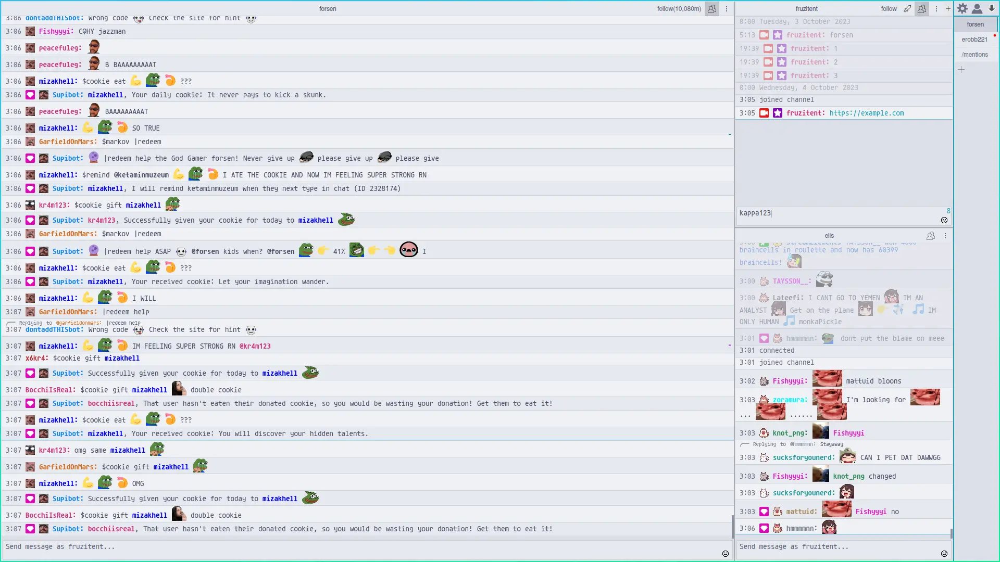
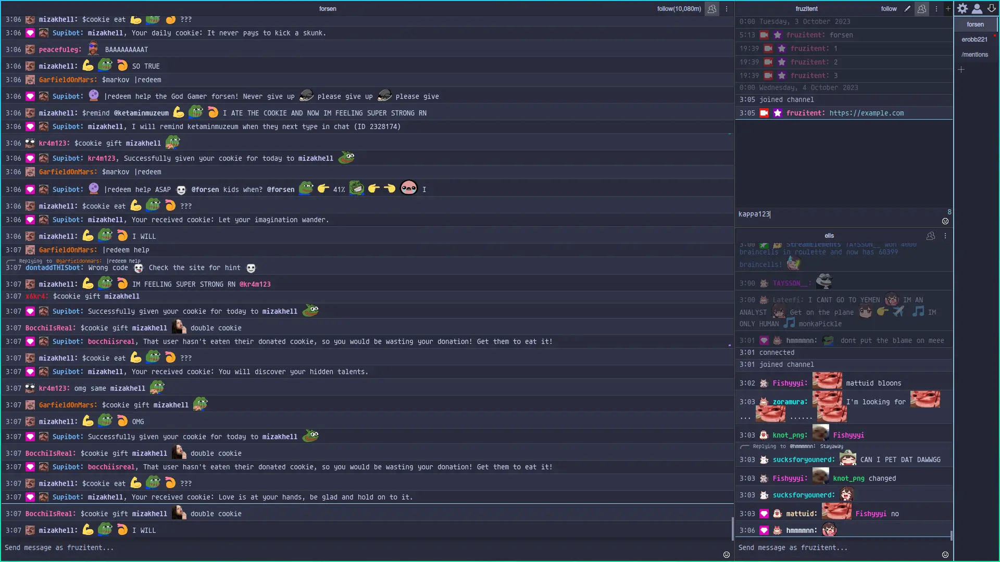

<h3 align="center">
  
  <br/>
  
  Catppuccin for <a href="https://github.com/chatterino/chatterino2">Chatterino 2</a>
  
</h3>

<p align="center">
  <a href="https://github.com/fruzitent/chatterino2/stargazers">
    
  </a>
  <a href="https://github.com/fruzitent/chatterino2/issues">
    
  </a>
  <a href="https://github.com/fruzitent/chatterino2/contributors">
    
  </a>
</p>


## Previews

<details>
<summary>🌻 Latte</summary>


</details>

<details>
<summary>🪴 Frappé</summary>


</details>

<details>
<summary>🌺 Macchiato</summary>


</details>

<details>
<summary>🌿 Mocha</summary>


</details>

## How to Use

1. Navigate to the following directory based on your operating system:

    - Linux: `${XDG_DATA_HOME}/chatterino`
    - Windows: `$env:APPDATA\Chatterino2`

2. Download and extract the latest release:

    ```shell
    wget "https://github.com/fruzitent/chatterino2/releases/latest/download/theme-accent.tar.gz" | tar --extract --file - --gzip
    ```

> [!WARNING]
> Be cautious as this action could potentially replace your existing settings.

## 💝 Thanks to

- [fruzitent](https://github.com/fruzitent)

&nbsp;

<p align="center">
 
</p>

<p align="center">
 Copyright &copy; 2021-present
 <a href="https://github.com/catppuccin" target="_blank">Catppuccin Org</a>
</p>

<p align="center">
 <a href="https://github.com/catppuccin/catppuccin/blob/main/LICENSE">
    
  </a>
</p>
