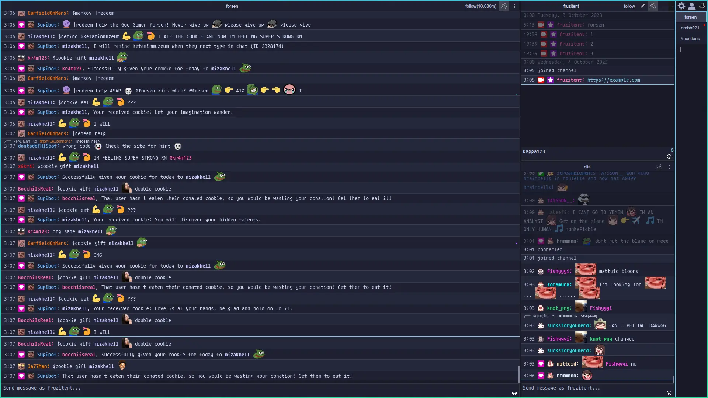
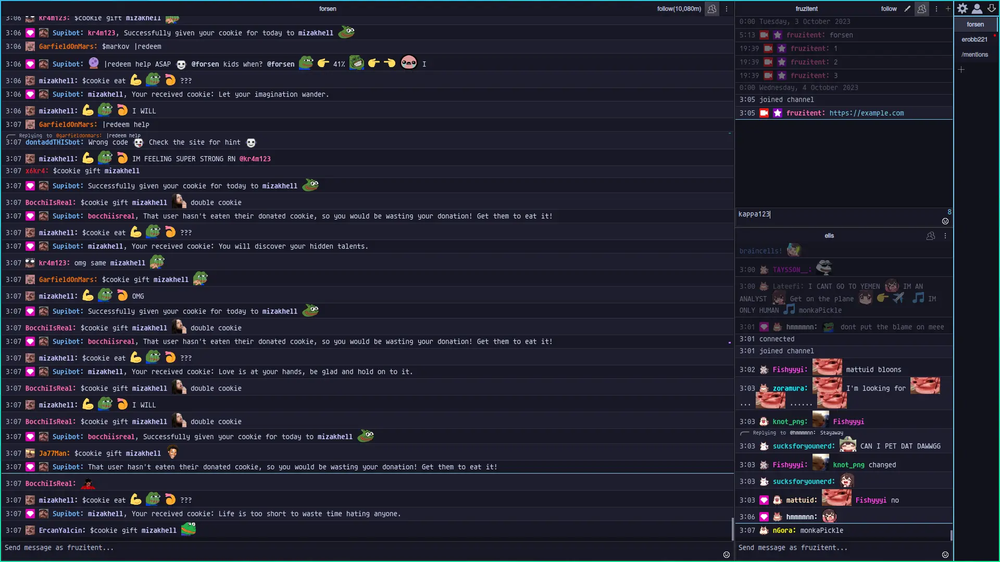

<h3 align="center">
  
  <br/>
  
  Catppuccin for <a href="https://github.com/chatterino/chatterino2">Chatterino 2</a>
  
</h3>

<p align="center">
  <a href="https://github.com/fruzitent/chatterino2/stargazers">
    
  </a>
  <a href="https://github.com/fruzitent/chatterino2/issues">
    
  </a>
  <a href="https://github.com/fruzitent/chatterino2/contributors">
    
  </a>
</p>


## Previews

<details>
<summary>🌻 Latte</summary>


</details>

<details>
<summary>🪴 Frappé</summary>


</details>

<details>
<summary>🌺 Macchiato</summary>


</details>

<details>
<summary>🌿 Mocha</summary>


</details>

## Usage

1. Copy files into [themesDirectory](https://github.com/Chatterino/chatterino2/blob/38a7ce695485e080f6e98e17c9b2a01bcbf17744/src/singletons/Paths.hpp#L41)

2. Apply changes to [settingsDirectory/settings.json](https://github.com/Chatterino/chatterino2/blob/38a7ce695485e080f6e98e17c9b2a01bcbf17744/src/singletons/Paths.hpp#L20)

    <details>
    <summary>2.1. Update active theme</summary>

    ```json
    {
      "appearance": {
        "theme": {
          "name": "theme-accent.json"
        },
      }
    }
    ```

    </details>

    <details>
    <summary>2.2. [Optional] Set "most recent message line" color to preferred accent</summary>

    ```json
    {
      "appearance": {
        "messages": {
          "lastMessageColor": "#AARRGGBB",
          "showLastMessageIndicator": true
        }
      }
    }
    ```

    </details>
